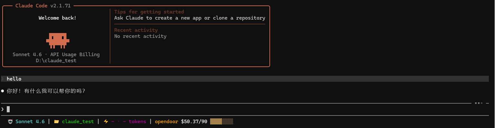

# OpenDoor StatusLine

[OpenDoor](https://code-opendoor.com) 官方 Claude Code 状态栏工具，实时显示余额和用量信息。

基于 Rust 开发，集成 Git 信息展示、用量追踪、交互式 TUI 配置和多主题系统。

> 本项目基于 [CCometixLine](https://github.com/cometix-ai/ccline) 和 [ByeByeCode](https://github.com/byebye-code/byebyecode) 的优秀工作进行开发，感谢原作者们的辛勤付出。

## 关于 OpenDoor

[OpenDoor](https://code-opendoor.com) 是专为国内开发者打造的 AI 编程中转服务平台，核心特性：

- **国内直连** - 无需科学上网，多地域节点保障稳定访问
- **多工具支持** - Claude Code / Codex / Cursor / Windsurf / Gemini 一站接入
- **按量付费** - 无月费无订阅，支付宝/微信充值，最低 10 元起
- **消费可控** - 多维度配额限制，多 Key 独立管理，实时用量监控
- **多模型覆盖** - Claude / GPT / Gemini 一个平台全搞定

注册即送体验额度，三步开始使用：注册账号 -> 充值余额 -> 一键接入 IDE

访问 [code-opendoor.com](https://code-opendoor.com) 了解更多。


## 截图



状态栏显示：模型 | 目录 | Git 分支状态 | 上下文窗口 | 用量信息

## 快速开始

### 前提条件

你需要先在 [OpenDoor](https://code-opendoor.com) 注册账号并完成 Claude Code 的接入配置，确保 `~/.claude/settings.json` 中已配置好 `ANTHROPIC_BASE_URL` 和 `ANTHROPIC_AUTH_TOKEN`。

如果你还没有配置，参考 OpenDoor 控制台的接入文档完成以下配置：

```json
// ~/.claude/settings.json
{
  "env": {
    "ANTHROPIC_BASE_URL": "https://code-opendoor.com/v1",
    "ANTHROPIC_AUTH_TOKEN": "你的 API Key"
  }
}
```

### 第 1 步：安装

**npm 安装（推荐）：**

```bash
npm install -g @code-opendoor-ai/statusline
```

国内加速：

```bash
npm install -g @code-opendoor-ai/statusline --registry=https://registry.npmmirror.com
```

**手动安装：**

1. 从 [Releases 页面](https://github.com/opendoor-ai/opendoor-statusline/releases) 下载对应平台的压缩包
2. 解压获取 `opendoor-statusline` 可执行文件
3. 放到系统 PATH 目录下，或放到以下位置：
   - macOS/Linux: `~/.claude/opendoor-statusline/opendoor-statusline`
   - Windows: `%USERPROFILE%\.claude\opendoor-statusline\opendoor-statusline.exe`
4. macOS/Linux 需要赋予执行权限：
   ```bash
   chmod +x ~/.claude/opendoor-statusline/opendoor-statusline
   ```

### 第 2 步：初始化

```bash
opendoor-statusline --init
```

这一步会：
- 在 `~/.claude/opendoor-statusline/` 下生成默认配置文件 `config.toml`
- 自动将 `~/.claude/settings.json` 的 `statusLine` 字段指向当前二进制路径
- 添加 OpenDoor 用量监控和订阅信息段

### 第 3 步：启动 Claude Code

```bash
claude
```

启动后状态栏会自动显示。工具会从 `settings.json` 中读取你的 API Key，调用 OpenDoor API 获取用量数据并展示在状态栏上。

显示效果类似：

```
 Opus 4.6 |  code-project |  main |  46.4% 92.8k tokens | opendoor $44.41/90 ▓▓▓▓░░░░
```

## 特性

### 状态栏段落

| 段落 | 说明 |
|------|------|
| `model` | 当前 AI 模型（如 Opus 4.6、Sonnet 4） |
| `directory` | 当前工作目录 |
| `git` | Git 分支名 + 状态（`✓` 清洁 / `●` 有更改 / `⚠` 冲突 / `↑↓` 领先落后） |
| `context_window` | 上下文窗口使用百分比和 token 数 |
| `usage` | API 用量（Claude 原生） |
| `cost` | 当前会话费用 |
| `opendoor_usage` | OpenDoor 用量（已用/限额 + 进度条） |

### 用量监控

- **自动读取 API Key** - 无需额外配置，直接从 `settings.json` 读取
- **进度条可视化** - 用量一目了然（如 `$13.86/$50 ▓▓▓░░░░░░░`）
- **状态色** - 用量 <50% 绿色，50%-80% 黄色，>80% 红色
- **额度耗尽提醒** - 用完后显示警告
- **缓存机制** - API 失败时降级到本地缓存，不影响状态栏显示

### 交互式 TUI 配置

```bash
opendoor-statusline --config
```

进入可视化配置界面，支持实时预览效果，可以调整段落顺序、启用/禁用、修改颜色和图标。

### 主题系统

内置多种主题，可通过命令行临时切换：

```bash
opendoor-statusline --theme gruvbox
opendoor-statusline --theme nord
opendoor-statusline --theme minimal
opendoor-statusline --theme powerline-dark
```

也可以在 `~/.claude/opendoor-statusline/themes/` 下放置自定义主题文件。

### Claude Code 补丁（可选）

禁用 "Context low" 警告、启用详细模式、添加状态栏自动刷新：

```bash
opendoor-statusline --patch /path/to/claude-code/cli.js
```

会自动创建备份文件，可随时恢复。

## 命令速查

| 命令 | 说明 |
|------|------|
| `opendoor-statusline --init` | 初始化配置并注册到 Claude Code |
| `opendoor-statusline --config` | 打开 TUI 可视化配置界面 |
| `opendoor-statusline --check` | 检查配置文件是否有效 |
| `opendoor-statusline --print` | 打印当前配置内容 |
| `opendoor-statusline --theme <name>` | 临时切换主题 |
| `opendoor-statusline --patch <path>` | 给 Claude Code cli.js 打补丁 |
| `opendoor-statusline --update` | 检查更新 |

## 配置文件

| 文件 | 路径 | 说明 |
|------|------|------|
| 主配置 | `~/.claude/opendoor-statusline/config.toml` | 段落、颜色、主题等配置 |
| API 密钥 | `~/.claude/opendoor-statusline/api_keys.toml` | 单独存放的 API Key（可选） |
| 自定义主题 | `~/.claude/opendoor-statusline/themes/*.toml` | 自定义主题文件 |
| Claude 配置 | `~/.claude/settings.json` | Claude Code 配置，statusLine 字段由 --init 自动写入 |

## 系统要求

- **Claude Code** - 状态栏依赖 Claude Code 运行
- **Node.js** >= 14（npm 安装方式需要）
- **Git** >= 1.5（推荐 2.22+）
- **终端字体** - 推荐安装 [Nerd Font](https://www.nerdfonts.com/) 以正确显示图标，中文用户推荐 [Maple Font](https://github.com/subframe7536/maple-font)

## 从源码构建

```bash
cargo build --release
```

构建产物位于 `target/release/opendoor-statusline`。

## 常见问题

### 安装后报 Binary not found

通常是 npm 路径解析或网络下载失败，尝试：

```bash
npm install -g @code-opendoor-ai/statusline --force
```

仍然失败请使用手动安装方式。

### 状态栏没有显示用量

检查 `~/.claude/settings.json` 中是否配置了 `ANTHROPIC_BASE_URL` 和 `ANTHROPIC_AUTH_TOKEN`，这两个字段是 OpenDoor 用量监控的数据来源。

### macOS 源码编译报错 (ring crate)

安装 Xcode Command Line Tools：

```bash
xcode-select --install
```

## 致谢

- [CCometixLine](https://github.com/cometix-ai/ccline) - 核心架构和状态栏生成的基础
- [ByeByeCode](https://github.com/byebye-code/byebyecode) - API 集成和增强功能的参考
- [tweakcc](https://github.com/Piebald-AI/tweakcc) - 自定义 Claude Code 主题的命令行工具

## 许可证

[MIT](LICENSE)
